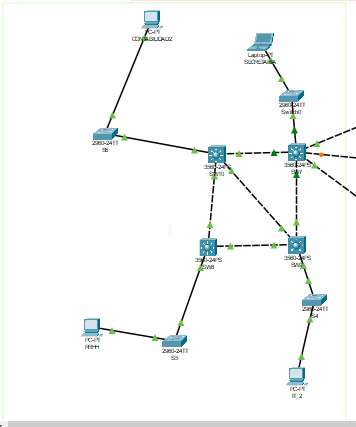
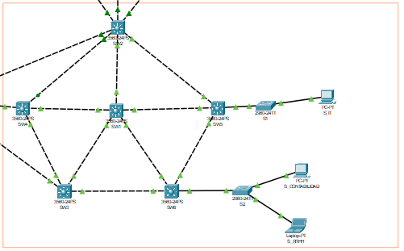
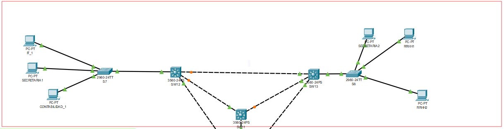
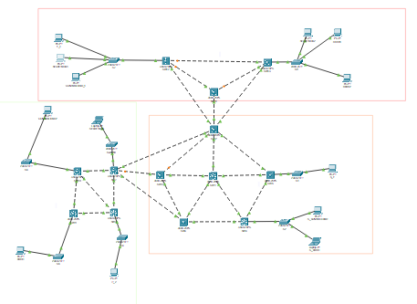
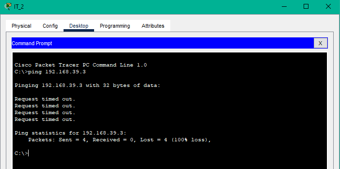
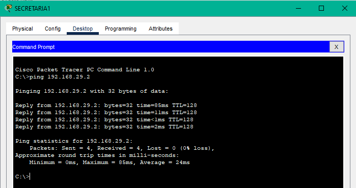

# Proyecto 1: Redes de Computadoras 1

Prototipo de topología de red reducida para la Municipalidad de Guatemala con diferentes departamentos que pueden coexistir,
compartiendo el mismo medio físico. La red creada contiene 4 departamentos, Contabilidad, Secretaria, Recursos Humanos(RRHH) e Informática (IT), los cuales no tienen transito de datos entre ellos y están identificados por VLANS.

## Grupo 4:

> -  **Luis Mariano Moreira García - 202010770**
> -  **María Cecilia Cotzajay López   - 201602659**
#

## Configuracion IPS Y VLANS

Las direcciones IP para esta red, fueron determinadas con un id de red *192.168.yx.0/24*, *VLAN: yx*, donde la *x* corresponde a la suma de los ultimos dos dígitos de carnets siendo 0+9 = **9**, la letra *y* corresponde 1=Contabilidad, 2=Secretaria, 3=RRHH y 4=Informática.

Quedando las IP Y VLANS de la siguiente manera:

| Departamento  | VLAN  | IP |
|--|--|--|
| Contabilidad | 19 | 192.168.10.0/24 |
| Secretaria | 29 | 192.168.20.0/24 |
| RRHH | 39 | 192.168.30.0/24 |
| IT | 49 | 192.168.40.0/24 |

## Implementación de las topologías.

### Topologia Centro administrativo

  

### Topologia Backbone

  

### Topologia Área de trabajo

  

### Topologia Completa

  

## Detalle de los comandos usados.

- **Configuracion General:** 
  - enable
  - conf t
  - hostname "nombre"
  - no ip domain-lookup
  - do wr
  - exit

- **Server:** 
  - enable
  - conf t
  - interface range f0/n-m
  - switchport trunk encapsulate dotlq
  - switchport mode trunk
  - vtp version 2
  - vtp mode server
  - vtp domanin P#(#corresponde al área)
  - vtp password "usac"
  - do sh vlan
  - do sh vtp status
  - do wr
  - exit

- **Cliente:** 
  - enable
  - conf t
  - interface range f0/n-m
  - switchport mode trunk
  - vtp mode client
  - vtp domanin P#(#corresponde al área)
  - vtp password "usac"
  - do sh vlan
  - do wr
  - exit

- **Modo Acceso:** 
  - enable
  - conf t
  - interface range f0/n-m
  - switchport mode access
  - do wr
  - exit

- **Modo Transparente:** 
  - enable
  - conf t
  - mode transparent
  - vtp domanin P#(#corresponde al área)
  - vtp password "usac"
  - do wr
  - exit

- **VLANS:** 
  - conft t
  - vlan 19
  - name contabilidad
  - vlan 29
  - name secretaria
  - vlan 39
  - name rrhh
  - vlan 49
  - name it
  - do wr
  - exit

- **Configuracion STP:** para el digito X=9 se utilizó RSTP correspondiente a impares. 
En switches:
  - enable
  - conf t
  - spanning-tree mode rapid-pvst
  - do wr
  - exit

## Ping entre hosts

- **Ping 1:**
De la IT_2: 192.168.49.2 a S_RRHH: 192.168.39.3 El cual esta correcto ya que NO realiza el ping.

  

  - **Ping 2:**
De la SECRETARIA_1: 192.168.29.1 a SECRETARIA_2: 192.168.29.2 El cual esta correcto ya que SI realiza el ping.

  